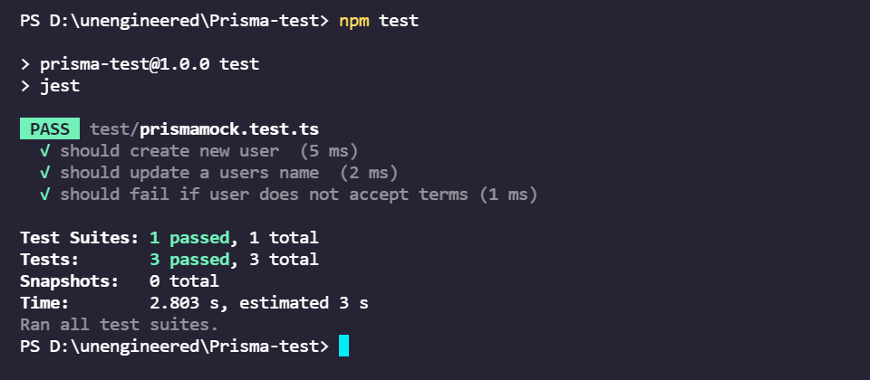

# Prisma-Mock

### Docker File is required to start the Postgres database server.

* Run the command to start the postgres server.

```
docker-compose up --build
```


## Output



## References
[Prisma Unit testing](https://www.prisma.io/docs/guides/testing/unit-testing)
